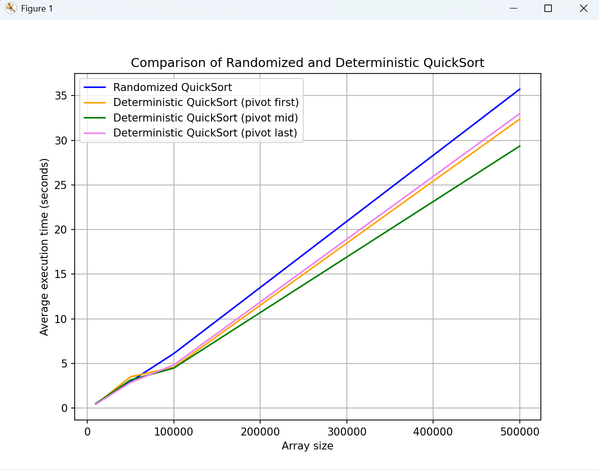
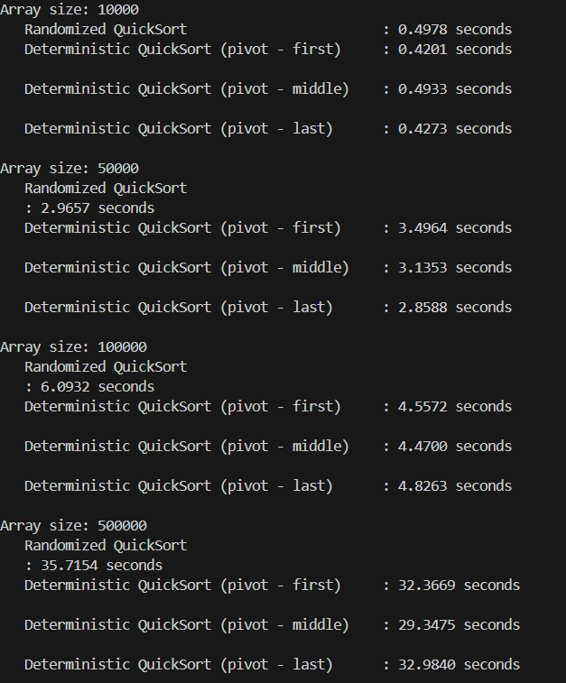
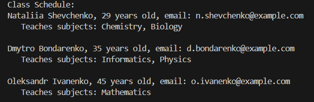

# Task 1. Comparison of Randomized and Deterministic QuickSort
Implement both randomized and deterministic versions of the QuickSort algorithm. Perform a comparative analysis of their efficiency by measuring the average execution time on arrays of different sizes.

## Conclusion
Based on the conducted tests, the efficiency of randomized and deterministic versions of the QuickSort algorithm was compared when sorting arrays of different sizes.

## Key observations:

- Performance of Deterministic QuickSort
In most cases, deterministic QuickSort was slightly faster than the randomized version. This was especially noticeable for smaller arrays (up to 100,000 elements), where it showed about a 10–15% advantage in speed.

- Pivot Selection
In deterministic QuickSort, the choice of pivot (first, middle, or last element) did not have a significant impact on performance. The tests showed similar execution times across all three options, with the middle element as pivot performing best on average.

- Behavior on Large Arrays
For large arrays (500,000 elements), the performance of all variants became more uniform. This is expected, as the likelihood of a poor pivot choice decreases with larger input sizes, and the algorithm approaches its expected time complexity of O(n log n).

- Randomized QuickSort
This version worked consistently but was slightly slower than the deterministic one. Its main advantage is robustness against already sorted or nearly sorted arrays, where deterministic QuickSort may degrade in performance due to poor pivot choices.

## Overall Conclusion:
- Deterministic QuickSort with the middle element as pivot showed slightly better average efficiency.
- Randomized QuickSort avoids the worst-case O(n²) scenario but has a slightly higher average runtime.
- For practical purposes, deterministic QuickSort with a middle or last pivot is a solid choice, while randomized QuickSort is valuable in unpredictable cases.
Overall, both approaches demonstrate strong performance, and the choice between them depends on the specific use case.

# Task 2. Scheduling Classes Using a Greedy Algorithm
Implement a program to create a university class schedule using a greedy algorithm for the set cover problem. The goal is to assign teachers to subjects in such a way that the number of teachers is minimized while ensuring that all subjects are covered.

## Conclusion
The algorithm returns a list of teachers and the subjects assigned to them. At each step of selection, it gives preference to the teacher who can teach the largest number of subjects that are not yet covered. If there are multiple such candidates, it chooses the youngest one by age.
